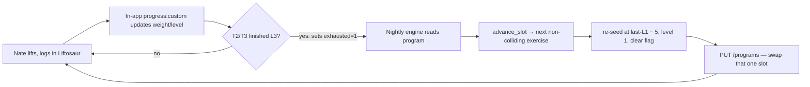

# Liftosaur Integration & Automation Plan

How the deterministic lifting engine (`scripts/lifting/`) will use Liftosaur as
its logging + display surface, and how the nightly sync is scheduled. Grounded in
the Liftosaur REST API and Liftoscript docs (repo: github.com/astashov/liftosaur).

## 1. Architecture decision — Option B (hybrid), chosen 2026-06-28

Liftoscript can natively express the *per-exercise* progression (set-variations
for the ladder + `progress: custom()` for the AMRAP / weight / reset logic). The
*shared-pool rotation with cross-day collision avoidance* is the hard part.
Verified empirically in the playground (2026-06-28): cross-exercise state **reads**
don't work (`state[tag].x` returns nothing), so a slot can't natively see what's
active on another day. It is *not strictly impossible* — the primitives for a
centralized controller exist (`numberOfSets=0` hides an exercise, an `update`
script self-gates sets, cross-exercise **writes** coordinate) — but it would be a
sprawling, brittle program (every pool exercise pre-listed per day) with
hand-coded collision logic and `print`-only debugging. The engine does the same
swap in ~10 tested lines, so we split it:

| Layer | Owns | How |
|---|---|---|
| **Liftosaur — every session, in-app** | Per-exercise progression: the 3-level ladder, AMRAP +5/+10, level drops, T1's 90% reset, T2/T3 weight/rep/time progression, prehab float | Set-variations + `progress: custom()` |
| **Python engine — nightly, only on exhaustion** | The pool swap: when an exercise finishes its 3 levels, pick the next queue exercise not active on another day, re-seed at last-L1 − 5, write it into the program | `scripts/lifting/` + REST `PUT /programs` |

~95% of sessions need no engine action — the app self-progresses. The nightly job
edits the program only on the rare session where a T2/T3 exercise exhausts.

## 2. The loop



No LLM anywhere. Most nights the engine reads, sees nothing exhausted, and exits.

## 3. The in-app program (native progression)

The program is written once and edited only on swaps. Each exercise carries a
`progress: custom()` script so Liftosaur self-progresses. Sketches (validate in
the playground before committing):

**T1** — set-variations *are* the ladder; the script does AMRAP +5/+10, the level
drop, and the 90%-of-L1 reset:

```
Squat / 3x4,1x4+ / 3x3,1x3+ / 3x2,1x2+ / progress: custom(prevL1: 0lb) {~
  var.base = setVariationIndex == 1 ? 4 : (setVariationIndex == 2 ? 3 : 2)
  var.extra = completedReps[ns] - var.base
  if (var.extra >= 5) { weights += 10lb }
  else if (var.extra >= 1) { weights += 5lb }
  else if (setVariationIndex == 1) { state.prevL1 = weights[1]; setVariationIndex = 2 }
  else if (setVariationIndex == 2) { setVariationIndex = 3 }
  else { setVariationIndex = 1; weights = roundWeight(state.prevL1 * 0.9) }
~}
```

Eccentric tempo per level → advanced descriptions (tracked by `descriptionIndex`).

**T2 / weighted T3** — ladder + add-on-completion; on L3 miss it sets an
`exhausted` flag the nightly engine watches (it does **not** self-swap):

```
Pendlay Row / 4x12 / 4x10 / 4x8 / progress: custom(lastL1: 0lb, exhausted: 0) {~
  if (completedReps >= reps) {
    if (setVariationIndex == 1) { state.lastL1 = weights[1] }
    weights += 5lb
  } else if (setVariationIndex < 3) {
    setVariationIndex += 1
  } else {
    state.exhausted = 1   // nightly engine swaps in the next pool exercise
  }
~}
```

**Bodyweight-rep / time T3** — anchor + ratio computed in-script; +1 rep / +1 s on
success. **Prehab finisher** — float: `if (cr[1] >= 50) weights += 5lb; if (cr[1] <
30) weights -= 5lb` (time variant: `+1s`); A/B handled by the day structure.

**Assisted/band** — equipment with *Is assisting?*; weight = assistance load; an
`update` script displays `bodyweight − assist`; progression reduces assistance.
Supersets via `superset: t2 / t3`; the prehab finisher is left solo.

## 4. API usage (membership required)

Auth `Authorization: Bearer lftsk_…` from `.env` (`LIFTOSAUR_API_KEY`), base
`https://www.liftosaur.com/api/v1`.

| Step | Call |
|---|---|
| One-time: create the program | `POST /programs` `{name, text}` → store the id |
| Nightly: read program | `GET /programs/<id>` → scan each T2/T3 for `state.exhausted == 1` |
| Nightly: swap (only if exhausted) | `PUT /programs/<id>` `{text}` with the one slot replaced + flag reset |
| Optional validate | `POST /playground` before writing |

The engine reads the **program** (not history) to detect exhaustion — the flag
lives in the program state, so it's simpler and authoritative. `GET /history` is
only needed if we later want analytics.

## 5. Nightly scheduled task (launchd)

`com.claude.lifting-sync` running `scripts/lifting/sync.py`.

- **Schedule:** ~03:15 local, daily.
- **Model:** none — deterministic, zero LLM cost.
- **Permissions:** `dangerouslySkipPermissions: true` (per repo scheduled-task rules).
- **Flow:** `GET /programs` → for each T2/T3 with `exhausted == 1`: archive its L1
  weight, `advance_slot()` to the next non-colliding exercise, re-seed at
  last-L1 − 5 at L1, clear the flag → if anything changed, `PUT /programs` and
  persist `engine-state.json`.
- **No-op most nights:** nothing exhausted → no write.
- **Safety:** never write if the read fails; iMessage alert on API error via
  `scripts/imessage-send.py`.
- **State file:** `areas/physical-health/exercise/engine-state.json` (queue cursors,
  active-by-day, archived last-L1 weights), committed by the job.
- **Audit:** run the full scheduled-task audit after adding it.

## 6. Migration steps (when the membership is live)

1. Liftosaur → Settings → **API Keys → Create** → add `LIFTOSAUR_API_KEY` to `.env`.
2. Configure **gym/equipment** in Liftosaur (bars, plates, dumbbells, bands) so
   weight rounding + plate calc match the home gym; set up *Is assisting?* band
   equipment for the assisted lifts.
3. Set **bodyweight** in the profile (drives assisted/bodyweight math).
4. Run the engine once to **POST the program** and seed `engine-state.json` from the
   derived starting weights (this prototype already produces them).
5. **Switch logging** from KeyLifts → Liftosaur. KeyLifts stays read-only for the
   historical seed only.
6. Enable the launchd job in **dry-run** (compute + render, no PUT) for a few days,
   eyeball the output, then flip on writes.

## 7. Open items before go-live

- **Band progression list** (assist levels, lightest→heaviest) — needed for the
  three assisted lifts.
- **Per-exercise anchors** for bodyweight-rep and time T3 (prototype defaults to 20).
- **Time-based representation** in Liftosaur (description vs timer) — pick one.
- **Validate the `progress: custom()` scripts** in the playground (esp. the T1
  reset and the T2/T3 `exhausted` flag) before going live.
- **Decide time-based representation** in Liftosaur (description vs rest-timer).
